# Technology Stack: Desktop, Mobile & Communications Fabric

Seventwos bridges human intent and agentic execution across physical devices, native applications, and decentralized networks. In an applied AI ecosystem:

- **The workspace captures intent.**
- **The repository captures implementation.**
- **The communications fabric (Matrix) coordinates humans and agents in real time.**

To deliver secure, real-time collaboration with native device fidelity, Seventwos unifies its clients around a **shared Rust core** (`matrix-rust-sdk` and Tauri v2) and adopts the battle-tested frontend frameworks proven in **Element X** (Matrix 2.0), following the desktop patterns established by **Claude Desktop** and **GitHub Copilot Desktop**. Where applicable and permitted, we build upon and extend these existing open-source foundations rather than reinventing them.

---

## 1. Cross-Platform Platform Matrix

| Layer | Desktop Client | iOS Mobile Client | Android Mobile Client |
| :--- | :--- | :--- | :--- |
| **Reference Anchor** | Claude Desktop & GitHub Copilot Desktop | Element X iOS | Element X Android |
| **Host Shell / Runtime** | **Tauri v2** (Rust + Native Webview) | Native Swift / iOS 18.5+ App | Native Kotlin / Modern Android App |
| **Fallback Shell** | Electron (Chromium + Node.js) | — | — |
| **UI Framework** | **React 19 + TypeScript + Vite** | **SwiftUI** (Declarative Native) | **Jetpack Compose** (Declarative Native) |
| **Design / Styling** | **Tailwind CSS** (Shared design tokens) | Apple Human Interface Guidelines | Material Design 3 (M3) |
| **Core Communications Engine**| **`matrix-rust-sdk`** (Native Rust crate) | **`matrix-rust-sdk`** (via UniFFI / Swift Package) | **`matrix-rust-sdk`** (via UniFFI / Kotlin bindings) |
| **Sync Protocol** | Simplified Sliding Sync (MSC4186) | Simplified Sliding Sync (MSC4186) | Simplified Sliding Sync (MSC4186) |
| **Encryption (E2EE)** | Vodozemac client-side (Megolm / Olm) | Vodozemac client-side (Megolm / Olm) | Vodozemac client-side (Megolm / Olm) |
| **Extensibility & Tools** | Model Context Protocol (MCP Client) | In-app Action Sheets & Push Actions | In-app Action Sheets & Push Actions |
| **Workspace Model** | Git Worktrees (Multi-agent branches) | Mobile Activity & Task Views | Mobile Activity & Task Views |
| **Local Persistence** | SQLite (Sessions, DAGs, Checkpoints) | `matrix-rust-sdk` state store (SQLite) + Keychain | `matrix-rust-sdk` state store (SQLite) + SQLDelight + Keystore |
| **Push Notifications** | OS Native Notifications | Apple Push Notification service (APNs) | UnifiedPush / Firebase Cloud Messaging (FCM) |

---

## 2. System Architecture Topology

The platform integrates Desktop clients, Mobile clients (Element X architecture), a decentralized Matrix communications fabric, and cloud AI agent backends — the desktop tier consumes `matrix-rust-sdk` as a native Rust crate with zero FFI, while mobile clients reach the same engine only by crossing a UniFFI boundary. End-to-end encryption is strictly client-side: Vodozemac runs inside every client SDK, and the homeserver relays only opaque ciphertext.

```mermaid
graph TD
    %% Zone container styling (outer tiers vs nested sub-containers)
    classDef zoneContainer fill:#020617,stroke:#334155,stroke-width:1px,color:#94a3b8;
    classDef subContainer fill:#0b1220,stroke:#475569,stroke-width:1px,stroke-dasharray: 3 3,color:#94a3b8;

    %% Leaf node styling
    classDef clientZone fill:#0f172a,stroke:#38bdf8,stroke-width:2px,color:#f8fafc;
    classDef nativeCore fill:#0f172a,stroke:#22d3ee,stroke-width:2px,color:#f8fafc;
    classDef ffiCore fill:#0f172a,stroke:#f59e0b,stroke-width:2px,stroke-dasharray: 5 5,color:#f8fafc;
    classDef cryptoZone fill:#1a0b2e,stroke:#c084fc,stroke-width:2px,color:#faf5ff;
    classDef matrixZone fill:#064e3b,stroke:#34d399,stroke-width:2px,color:#f0fdf4;
    classDef execZone fill:#1e1b4b,stroke:#818cf8,stroke-width:2px,color:#e0e7ff;
    classDef cloudZone fill:#451a03,stroke:#fb923c,stroke-width:2px,color:#fff7ed;

    %% Tier 1: Client Interfaces (Intent Capture)
    subgraph Clients ["1. Client Interfaces — Human Intent Capture"]
        subgraph DesktopClient ["Desktop Client — Zero-FFI Rust Host"]
            D_UI["Desktop UI (React 19 + Vite)"]
            D_Tauri(["Tauri v2 Host Core (Rust)"])
            D_Matrix(["matrix-rust-sdk (Native Crate)"])
            D_Crypto["Vodozemac E2EE (Olm / Megolm)"]
            D_UI <-->|Tauri IPC| D_Tauri
            D_Tauri -->|Direct call: zero FFI| D_Matrix
            D_Matrix <-->|Encrypt / decrypt in process| D_Crypto
        end

        subgraph MobileClients ["Mobile Clients — UniFFI Bridge to Rust"]
            iOS_UI["iOS App (SwiftUI)"]
            iOS_Rust(["matrix-rust-sdk via UniFFI"])
            iOS_Crypto["Vodozemac E2EE (Olm / Megolm)"]
            iOS_UI <-->|UniFFI: Swift to Rust| iOS_Rust
            iOS_Rust <-->|Encrypt / decrypt in process| iOS_Crypto

            And_UI["Android App (Jetpack Compose)"]
            And_Rust(["matrix-rust-sdk via UniFFI"])
            And_Crypto["Vodozemac E2EE (Olm / Megolm)"]
            And_UI <-->|UniFFI: Kotlin to Rust| And_Rust
            And_Rust <-->|Encrypt / decrypt in process| And_Crypto
        end
    end

    %% Tier 2: Communications Fabric (Real-Time Decentralized Coordination)
    subgraph Fabric ["2. Communications Fabric — Matrix 2.0 Network (zero-knowledge relay)"]
        Homeserver(["Matrix 2.0 Homeserver (Synapse)"])
        NativeSync["Native Sliding Sync Endpoint (MSC4186)"]
        Federation{{"Federated Homeservers (Matrix network)"}}
        Homeserver -->|Serves sync natively| NativeSync
        Homeserver <-->|Server-to-server federation| Federation
    end

    %% Tier 3: Execution & Agent Intelligence
    subgraph Execution ["3. Execution & Implementation Tier"]
        subgraph LocalExecution ["Local Desktop Sandbox"]
            D_Git["Git Worktree Manager (Branch Isolation)"]
            D_SQLite[("Local SQLite Store (Sessions & DAGs)")]
            D_MCP["Model Context Protocol (MCP) Client"]
            LocalTools{{"Local Dev Tools (Node / Python / Shell)"}}

            D_Tauri -->|Session control| D_Git
            D_Tauri -->|State persistence| D_SQLite
            D_Tauri -->|Tool invocation| D_MCP
            D_MCP <-->|stdio / JSON-RPC| LocalTools
        end

        subgraph CloudBackend ["Seventwos Cloud & Agent Services"]
            MatrixAS["Matrix Application Service (Agent Bots)"]
            AgentGateway(["Agent Gateway (Azure Functions C#)"])
            FrontierLLMs{{"Frontier LLMs (Claude Opus/Sonnet, GPT-5/6, Gemini)"}}
            CosmosDB[("Azure Cosmos DB NoSQL")]

            MatrixAS <-->|Event webhook| AgentGateway
            AgentGateway <-->|Inference API| FrontierLLMs
            AgentGateway <-->|State read/write| CosmosDB
        end
    end

    %% Cross-Tier Connections
    D_Matrix <-->|MSC4186 sync: ciphertext only| NativeSync
    iOS_Rust <-->|MSC4186 sync: ciphertext only| NativeSync
    And_Rust <-->|MSC4186 sync: ciphertext only| NativeSync

    Homeserver <-->|Matrix AS Protocol| MatrixAS
    AgentGateway -.->|Task Dispatch & Diffs| D_UI

    %% Apply Class Styles
    class Clients,Fabric,Execution zoneContainer;
    class DesktopClient,MobileClients,LocalExecution,CloudBackend subContainer;
    class D_UI,D_Tauri,iOS_UI,And_UI clientZone;
    class D_Matrix nativeCore;
    class iOS_Rust,And_Rust ffiCore;
    class D_Crypto,iOS_Crypto,And_Crypto cryptoZone;
    class Homeserver,NativeSync,Federation matrixZone;
    class D_Git,D_SQLite,D_MCP,LocalTools execZone;
    class MatrixAS,AgentGateway,FrontierLLMs,CosmosDB cloudZone;
```

---

## 3. Desktop Application Specification

The desktop client is optimized for high-intensity engineering, agent coordination, and local environment execution.

### 3.1. Shell Architecture: Tauri v2
- **Unified Rust Foundation**: Because Tauri v2 is written in Rust, it imports `matrix-rust-sdk` natively as a dependency without the overhead of foreign function interfaces.
- **Resource Footprint**: Renders through operating system native webviews (WebView2 on Windows, WebKit on macOS, WebKitGTK on Linux). Published baseline measurements for minimal shells report:
  - Idle RAM consumption under 60 MB (versus 250–400 MB in standard Electron shells).
  - Installer sizes under 20 MB (versus 85–130 MB for bundled Chromium binaries).
  - Sub-second launch time.
  These are baseline figures for lightweight shells, not production footprints — real memory use scales with DOM complexity and varies by platform webview.
- **Electron Fallback Mode**: The presentation tier is decoupled from host primitives, enabling an Electron wrapper when enterprise environments enforce legacy Node.js C++ addons or pinned Chromium revisions.

### 3.2. Presentation Layer: React 19 + Vite
- **Components & Layout**: React 19 concurrent rendering with TypeScript, styled via Tailwind CSS using Seventwos brand design tokens.
- **Client State**: Zustand for fast, predictable client-side UI state management (window panes, active session pointers, chat viewports).
- **Workspace Canvases**: Dedicated side-by-side surfaces for diff inspection, terminal execution, and markdown preview.

### 3.3. Tool Protocol: Model Context Protocol (MCP)
- Adopts the open standard released by Anthropic in November 2024 and adopted across modern AI developer tooling:
  - Runs local MCP servers as subprocesses over `stdio` using newline-delimited JSON-RPC 2.0.
  - Connects to remote servers over **Streamable HTTP**, the transport introduced in MCP revision `2025-03-26` that superseded the deprecated HTTP+SSE transport. Legacy HTTP+SSE is supported only where older servers require it.
  - Exposes tools (file viewing, code search, git operations, browser execution, database queries) directly to active agents.

### 3.4. Multi-Agent Workspace Isolation: Git Worktrees
- Aligns with GitHub Copilot Desktop workspace isolation:
  - Each task turn runs in an isolated Git worktree.
  - Prevents dirty state collisions between concurrent agent sessions.
  - Guarantees that code commits remain atomic and auditable.

---

## 4. Mobile Client Specification (Element X Foundation)

The mobile applications for iOS and Android are built upon **Element X**, the reference implementation for next-generation Matrix 2.0 clients.

### 4.1. Core Engine: `matrix-rust-sdk`
- Both iOS and Android clients share a single, battle-tested cryptographic and protocol core written in Rust.
- **Key Capabilities**:
  - High-performance state storage and event caching.
  - End-to-end encryption via **Vodozemac** (pure-Rust implementation of Olm and Megolm protocols), executed entirely on-device — the homeserver never holds decryption keys.
  - Modern OIDC authentication flow (MSC2965 / MSC3861).
  - VoIP and group video integration via **MatrixRTC** (MSC4143).

### 4.2. iOS Application (Element X iOS)
- **Language & UI**: Swift 6 and **SwiftUI**, with a minimum deployment target of iOS 18.5.
- **Integration**: The Rust SDK is compiled as a multi-architecture framework and imported into the Xcode project via a Swift Package with **UniFFI** bindings.
- **iOS-Specific Features**:
  - Background sync using iOS Background Tasks framework.
  - Secure key storage in the Apple Keychain with Face ID / Touch ID biometric authentication.
  - Interactive push notifications through Apple Push Notification service (APNs).

### 4.3. Android Application (Element X Android)
- **Language & UI**: Kotlin and **Jetpack Compose**.
- **Integration**: `matrix-rust-sdk` is compiled into native libraries (`.so`) for ARM/x86 architectures, exposed through Kotlin wrappers generated via **UniFFI**.
- **Android-Specific Features**:
  - Android Keystore integration for cryptographic key protection.
  - Flexible push architecture supporting both UnifiedPush (privacy-focused) and Firebase Cloud Messaging (FCM).
  - Native Material Design 3 theming with dynamic color adaptability.

---

## 5. Communications Fabric: Matrix Protocol (matrix.org)

Matrix provides the decentralized, secure messaging backbone connecting humans and AI agents.

### 5.1. Why Matrix for Agentic Workflows?
1. **Decentralized & Federatable**: Organizations own their data; private homeservers ensure sensitive workspace conversations never leak to third-party proprietary chat servers.
2. **First-Class Agent Identity**: Each AI agent participates as a first-class Matrix account or Application Service bot within shared rooms — addressable, attributable, and subject to the same room membership and permission model as human participants.
3. **Client-Side End-to-End Encryption**: Task deliberations, code diff reviews, and intent discussions are encrypted on-device via Vodozemac. Homeservers relay opaque ciphertext and never hold Megolm session keys.
4. **Simplified Sliding Sync (MSC4186)**: Reduces room synchronization times from tens of seconds to milliseconds. Served natively by the homeserver — the standalone MSC3575 proxy was sunset in November 2024 and is not part of this architecture.

### 5.2. Backend Integration & Agent Connectivity
- **Matrix Application Service (AS)**:
  - Seventwos agent backends run as a registered Matrix Application Service.
  - The AS receives room events across all workspace rooms without requiring distinct socket connections per agent.
  - **Encryption constraint**: an Application Service receives events as the homeserver stores them, so in an encrypted room it sees only `m.room.encrypted` ciphertext. Agent coordination therefore runs either in unencrypted management rooms or through a registered machine client holding its own E2EE device identity and session keys.
- **Azure Functions (C#) & AI Gateway**:
  - Inbound Matrix events trigger agent workflows in the cloud backend.
  - The agent orchestrator coordinates frontier LLMs (Claude Sonnet 5, Claude Opus 5, GPT-5.6 Sol, Gemini 3.8 Flash).
  - Agents format replies using structured Markdown, interactive widget definitions, and diff payloads posted directly back into the Matrix room timeline.

---

## 6. Fact-Checking & Source Verification

*Each specification item below carries a verification status. `[VERIFIED]` items are confirmed against a primary source — a protocol specification, official announcement, or the vendor's own public repository. `[DIRECTIONAL]` items are widely reported and consistent with observable evidence, but no vendor publishes an authoritative architecture manifest for them; they are recorded here as working assumptions rather than established fact.*

| # | Specification Item | Verification Detail | Status | Authoritative Source | Confidence |
|---|-------------------|---------------------|--------|----------------------|------------|
| 1 | Claude Desktop Host | Widely reported as an Electron application using web technologies for macOS and Windows. Anthropic publishes MCP configuration guidance for the client but no client architecture manifest, so this rests on distribution-bundle inspection rather than a vendor statement. | `[DIRECTIONAL]` | [Anthropic MCP Documentation](https://modelcontextprotocol.io/docs/develop/connect-local-servers) (configuration only) | 3/5 |
| 2 | GitHub Copilot Desktop App | Git worktree session isolation is an observable, documented Copilot coding-agent pattern. The host shell technology is **not** published by GitHub; Tauri v2 is Seventwos' own architectural choice for the desktop client, not a confirmed match to Copilot Desktop's internals. | `[DIRECTIONAL]` | [GitHub Copilot Documentation](https://docs.github.com/en/copilot) | 2/5 |
| 3 | Element X Core SDK | Element X iOS and Element X Android share `matrix-rust-sdk` as their foundational synchronization and crypto engine. | `[VERIFIED]` | [Element X Official Announcement & GitHub Repositories](https://github.com/element-hq/element-x-ios) | 5/5 |
| 4 | Element X iOS Tech Stack | Written in Swift and SwiftUI, interfacing with `matrix-rust-sdk` via Swift Package and UniFFI FFI bindings. | `[VERIFIED]` | [Element X iOS Repository](https://github.com/element-hq/element-x-ios) | 5/5 |
| 5 | Element X Android Tech Stack | Written in Kotlin and Jetpack Compose, communicating with `matrix-rust-sdk` through UniFFI bindings. | `[VERIFIED]` | [Element X Android Repository](https://github.com/element-hq/element-x-android) | 5/5 |
| 6 | Matrix 2.0 Sync Protocol | Simplified Sliding Sync (MSC4186) is served natively by Synapse. It supersedes MSC3575; the standalone sliding-sync proxy was shut down on 21 November 2024 and client support was dropped in January 2025. | `[VERIFIED]` | [Matrix.org: Sunsetting the Sliding Sync Proxy](https://matrix.org/blog/2024/11/14/moving-to-native-sliding-sync/) | 5/5 |
| 7 | E2EE Trust Boundary | Vodozemac (Olm / Megolm in Rust) executes inside each client's `matrix-sdk-crypto`. Homeservers and sync endpoints relay opaque `m.room.encrypted` payloads and never hold Megolm session keys. | `[VERIFIED]` | [matrix-org/vodozemac](https://github.com/matrix-org/vodozemac) & [Matrix E2EE Concepts](https://matrix.org/docs/matrix-concepts/end-to-end-encryption/) | 5/5 |
| 8 | Matrix Application Service API | Homeservers push room events to registered Application Services in bulk transactions via `PUT /_matrix/app/v1/transactions/{txnId}`, without per-agent polling. | `[VERIFIED]` | [Matrix Application Service API Specification](https://spec.matrix.org/latest/application-service-api/) | 5/5 |
| 9 | MCP Local Transport | MCP clients spawn local servers as subprocesses and exchange newline-delimited JSON-RPC 2.0 messages over stdio. | `[VERIFIED]` | [Model Context Protocol: Transports](https://modelcontextprotocol.io/specification/basic/transports) | 5/5 |
| 10 | MCP Remote Transport | Streamable HTTP was introduced in MCP revision `2025-03-26` and supersedes the HTTP+SSE transport defined in `2024-11-05`, which is deprecated and retained only for backward compatibility. | `[VERIFIED]` | [MCP Specification: Streamable HTTP](https://modelcontextprotocol.io/specification/basic/transports) | 5/5 |
| 11 | Element X Local Persistence | Neither client uses CoreData or Room. Both delegate room state to the `matrix-rust-sdk` SQLite state store; Element X Android additionally uses SQLDelight (`app.cash.sqldelight` 2.3.2), and Element X iOS uses `KeychainAccess` for credential storage. | `[VERIFIED]` | [element-x-android `libs.versions.toml`](https://github.com/element-hq/element-x-android/blob/develop/gradle/libs.versions.toml) & [element-x-ios `project.yml`](https://github.com/element-hq/element-x-ios/blob/develop/project.yml) | 5/5 |
| 12 | Element X iOS Deployment Target | `project.yml` declares a minimum deployment target of iOS 18.5 and consumes `matrix-rust-components-swift` as a pinned Swift Package. | `[VERIFIED]` | [element-x-ios `project.yml`](https://github.com/element-hq/element-x-ios/blob/develop/project.yml) | 5/5 |
| 13 | Cross-Platform Rust Synergy | Both Tauri v2 (Desktop) and Element X (Mobile) utilize Rust as their native foundation, allowing direct crate reuse of `matrix-rust-sdk`. | `[VERIFIED]` | [Tauri v2 Documentation](https://v2.tauri.app) & [Matrix Rust SDK](https://github.com/matrix-org/matrix-rust-sdk) | 5/5 |

