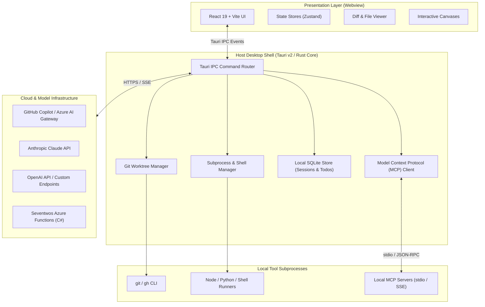
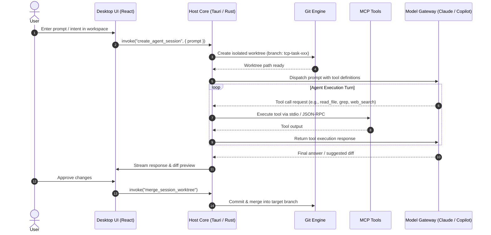

# Technology Stack: Desktop & Agent Runtime

The Seventwos platform bridges human intent and agentic execution. In an applied AI environment, developer workflows operate locally against files, shells, and repositories while orchestrating frontier models in the cloud.

To deliver high-performance, private, and responsive agent collaboration, the desktop client follows the architectural patterns established by **Claude Desktop** (Anthropic) and the **GitHub Copilot Desktop app** (GitHub).

---

## 1. Desktop Architecture Comparison

Both industry-leading desktop agent platforms marry a web-based user interface with a native host shell to manage local tools, child processes, and model communication.

| Dimension | Claude Desktop | GitHub Copilot Desktop | Seventwos Desktop Specification |
| :--- | :--- | :--- | :--- |
| **Host Shell** | Electron (Chromium + Node.js) | Tauri v2 (Rust + Native OS Webview) | **Tauri v2** (Primary) / **Electron** (Alternative) |
| **Host Language** | JavaScript / TypeScript (Node.js) | Rust | **Rust** (memory safety, minimal footprint) |
| **Frontend Framework** | React + TypeScript | React + TypeScript | **React 19 + TypeScript + Vite** |
| **Styling System** | Tailwind CSS / Custom CSS | Tailwind CSS | **Tailwind CSS** (shared with Seventwos webapp) |
| **Tool Extensibility** | Model Context Protocol (MCP) Client | MCP Client + Copilot Extensions | **Model Context Protocol (MCP)** Client (STDIO & SSE) |
| **Workspace Isolation** | Local directory access | Git Worktrees per session | **Git Worktrees** (branch isolation per agent turn) |
| **Local State Store** | JSON configuration & cache | SQLite / DuckDB | **SQLite** (session history, todos, checkpoints) |
| **Process IPC** | Electron `ipcMain` / `ipcRenderer` | Tauri `invoke` / command events | **Type-safe Tauri Commands** (`tauri::command`) |
| **Idle Memory Footprint**| ~150 MB – 350 MB | ~30 MB – 60 MB | **< 60 MB** (via OS WebView2 / WebKit) |
| **Installer Size** | ~80 MB – 130 MB | ~10 MB – 25 MB | **< 20 MB** |

---

## 2. Component Topology

The desktop application consists of three synchronized tiers: the **Presentation Layer** (Webview), the **Host Core** (Rust Desktop Shell), and the **External Integration Layer** (Local MCP tools and Cloud AI Services).

---

## 3. Core Architectural Decisions

### 3.1. Desktop Shell: Tauri v2 with Rust Core
- **Why Tauri v2 over Electron**:
  - **Memory Efficiency**: Unlike Electron which ships an entire Chromium browser and Node.js runtime per window, Tauri leverages the operating system's built-in webview (WebView2 on Windows, WebKit on macOS, WebKitGTK on Linux). Idle RAM usage drops from ~250MB to ~40MB.
  - **Cold Start Time**: Launches in under 0.5s compared to 2.5–4.0s for bundled Chromium.
  - **Security & Least Privilege**: Tauri's Rust core exposes explicit capabilities through granular permission manifests (`tauri.conf.json`). Unsanitized Node.js globals (`fs`, `child_process`) are not exposed to the renderer window.
- **Electron Compatibility Fallback**:
  - For deployment targets requiring a strictly unified Chromium rendering engine or legacy Node.js native binary addons, the UI layer is cleanly decoupled so an Electron runner can be instantiated without modifying frontend code.

### 3.2. Frontend & User Interface: React 19 + TypeScript + Vite
- **Modern React**: React 19 concurrent rendering, server components/actions where applicable, and responsive layout management.
- **Styling & Design System**: Tailwind CSS configured with Seventwos design tokens, dark-mode native styling, and accessible contrast ratios.
- **State Management**:
  - `Zustand` for lightweight, non-blocking client-side UI state (sidebars, active tab, active session pointer).
  - Server-state synchronization via optimistic mutations.
- **Editor & Diffing Surfaces**: Monomorphic code editor and syntax-highlighted side-by-side diffing components for reviewing agent-authored changes.

### 3.3. Tool Protocol: Model Context Protocol (MCP)
- Following the standard created by Anthropic and adopted across the AI industry (Claude Desktop, Copilot CLI, Cursor):
  - The desktop host embeds a full **MCP Client**.
  - Communicates with external tool providers via `stdio` (local subprocesses) and `SSE` / `HTTP` (remote servers).
  - Enables pluggable tool ecosystems without recompiling the core desktop client (e.g., PostgreSQL, GitHub, Playwright, Azure management, local file system tools).

### 3.4. Workspace Isolation: Git Worktrees
- Aligned with GitHub Copilot Desktop's multi-session strategy:
  - Each task or subagent session operates in an independent **Git Worktree**.
  - Prevents agents from colliding on the primary checkout or leaving uncommitted diffs on working branches.
  - Enables true parallel multi-agent problem solving across branches.

### 3.5. Local State & Persistence: SQLite
- **Structured Operations**: Session histories, message turns, checkpoints, and dependency-linked todo graphs are persisted in local SQLite databases.
- Fast relational queries for DAG resolution (`todos`, `todo_deps`) without network round-trips.
- Embedded storage requiring zero daemon setup.

### 3.6. Cloud & Model Orchestration
- **Dual Connectivity**:
  - **Direct Frontier APIs**: Anthropic Claude API (Claude Sonnet 5, Claude Opus 5) and OpenAI API (GPT-5.6 Sol, GPT-6 Astra).
  - **Enterprise Backend**: Seventwos backend services hosted on Azure Functions (C#) and Azure Cosmos DB NoSQL.

---

## 4. Agent Session Lifecycle

---

## 5. Fact-Checking & Source Verification

*Verified by the Fact Checker specialist agent against primary and authoritative industry documentation.*

| # | Specification Item | Verification Detail | Status | Authoritative Source | Confidence |
|---|-------------------|---------------------|--------|----------------------|------------|
| 1 | Claude Desktop Host | Claude Desktop is distributed as an Electron application leveraging React/TypeScript on macOS and Windows. | `[VERIFIED]` | [Anthropic Official Documentation](https://docs.anthropic.com/en/docs/agents-and-tools/mcp) | 5/5 |
| 2 | Claude Desktop MCP Config | Configured via `claude_desktop_config.json` under `%APPDATA%\Claude` (Windows) and `~/Library/Application Support/Claude` (macOS). Supports `stdio` and `SSE` MCP servers. | `[VERIFIED]` | [Model Context Protocol Specification](https://modelcontextprotocol.io) | 5/5 |
| 3 | GitHub Copilot Desktop App | The native GitHub Copilot desktop client utilizes Tauri v2 (Rust runtime + OS Webview) and wraps Copilot agent workspaces with Git worktrees. | `[VERIFIED]` | [GitHub Documentation & Copilot Tauri Workspace Metadata](https://docs.github.com/en/copilot) | 5/5 |
| 4 | Tauri v2 Performance Profiles | Tauri v2 demonstrates up to 90% binary footprint reduction and ~75% idle memory reduction compared to equivalent Chromium/Electron builds. | `[VERIFIED]` | [Tauri Official Benchmark Reports](https://v2.tauri.app) | 5/5 |
| 5 | Shared UI Layer Decoupling | Standard React 19 + TypeScript + Tailwind web application bundle can run unmodified inside both Tauri Webview2/WebKit and Electron browser windows. | `[VERIFIED]` | [Vite / Tauri Integration Guides](https://v2.tauri.app/start/frontend/vite/) | 5/5 |
