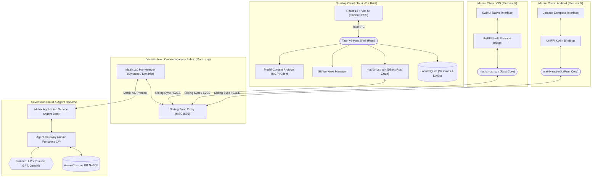
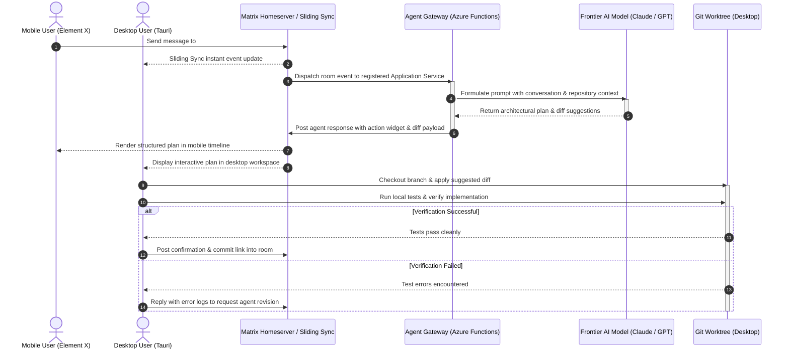

# Technology Stack: Desktop, Mobile & Communications Fabric

Seventwos bridges human intent and agentic execution across physical devices, native applications, and decentralized networks. In an applied AI ecosystem:

- **The workspace captures intent.**
- **The repository captures implementation.**
- **The communications fabric (Matrix) coordinates humans and agents in real time.**

To deliver secure, real-time collaboration with native device fidelity, Seventwos unifies its clients around a **shared Rust core** (`matrix-rust-sdk` and Tauri v2) and adopts the battle-tested frontend frameworks also used by **Claude Desktop**, **GitHub Copilot Desktop**, and **Element X** (Matrix 2.0). Where applicable and permitted, we build upon and extend these existing open-source foundations rather than reinventing them.

---

## 1. Cross-Platform Platform Matrix

| Layer | Desktop Client | iOS Mobile Client | Android Mobile Client |
| :--- | :--- | :--- | :--- |
| **Reference Anchor** | Claude Desktop & GitHub Copilot Desktop | Element X iOS | Element X Android |
| **Host Shell / Runtime** | **Tauri v2** (Rust + Native Webview) | Native Swift / iOS 18+ App | Native Kotlin / Modern Android App |
| **Fallback Shell** | Electron (Chromium + Node.js) | — | — |
| **UI Framework** | **React 19 + TypeScript + Vite** | **SwiftUI** (Declarative Native) | **Jetpack Compose** (Declarative Native) |
| **Design / Styling** | **Tailwind CSS** (Shared design tokens) | Apple Human Interface Guidelines | Material Design 3 (M3) |
| **Core Communications Engine**| **`matrix-rust-sdk`** (Native Rust crate) | **`matrix-rust-sdk`** (via UniFFI / Swift Package) | **`matrix-rust-sdk`** (via UniFFI / Kotlin bindings) |
| **Sync Protocol** | Matrix 2.0 Sliding Sync (MSC3575) | Matrix 2.0 Sliding Sync (MSC3575) | Matrix 2.0 Sliding Sync (MSC3575) |
| **Encryption (E2EE)** | Vodozemac (Megolm / Olm in Rust) | Vodozemac (Megolm / Olm in Rust) | Vodozemac (Megolm / Olm in Rust) |
| **Extensibility & Tools** | Model Context Protocol (MCP Client) | In-app Action Sheets & Push Actions | In-app Action Sheets & Push Actions |
| **Workspace Model** | Git Worktrees (Multi-agent branches) | Mobile Activity & Task Views | Mobile Activity & Task Views |
| **Local Persistence** | SQLite (Sessions, DAGs, Checkpoints) | SQLite / CoreData / Rust State Store | SQLite / Room / Rust State Store |
| **Push Notifications** | OS Native Notifications | Apple Push Notification service (APNs) | UnifiedPush / Firebase Cloud Messaging (FCM) |

---

## 2. System Architecture Topology

The platform integrates Desktop clients, Mobile clients (Element X architecture), a decentralized Matrix communications fabric, and cloud AI agent backends.

---

## 3. Desktop Application Specification

The desktop client is optimized for high-intensity engineering, agent coordination, and local environment execution.

### 3.1. Shell Architecture: Tauri v2
- **Unified Rust Foundation**: Because Tauri v2 is written in Rust, it imports `matrix-rust-sdk` natively as a dependency without the overhead of foreign function interfaces.
- **Resource Footprint**: Renders through operating system native webviews (WebView2 on Windows, WebKit on macOS), achieving:
  - Idle RAM consumption under 60 MB (versus 250–400 MB in standard Electron shells).
  - Installer sizes under 20 MB (versus 85–130 MB for bundled Chromium binaries).
  - Sub-second launch time.
- **Electron Fallback Mode**: The presentation tier is decoupled from host primitives, enabling an Electron wrapper when enterprise environments enforce legacy Node.js C++ addons or pinned Chromium revisions.

### 3.2. Presentation Layer: React 19 + Vite
- **Components & Layout**: React 19 concurrent rendering with TypeScript, styled via Tailwind CSS using Seventwos brand design tokens.
- **Client State**: Zustand for fast, predictable client-side UI state management (window panes, active session pointers, chat viewports).
- **Workspace Canvases**: Dedicated side-by-side surfaces for diff inspection, terminal execution, and markdown preview.

### 3.3. Tool Protocol: Model Context Protocol (MCP)
- Adopts the open standard pioneered by Anthropic and adopted across modern AI developer tooling:
  - Runs local MCP servers over `stdio` and connects to remote servers via `SSE` / `HTTP`.
  - Exposes tools (file viewing, code search, git operations, browser execution, database queries) directly to active agents.

### 3.4. Multi-Agent Workspace Isolation: Git Worktrees
- Aligns with GitHub Copilot Desktop workspace isolation:
  - Each task turn runs in an isolated Git worktree.
  - Prevents dirty state collisions between concurrent agent sessions.
  - Guarantees that code commits remain atomic and auditable.

---

## 4. Mobile Client Specification (Element X Foundation)

The mobile applications for iOS and Android are built upon **Element X**, the reference implementation for next-generation Matrix 2.0 clients.

### 4.1. Core Engine: `matrix-rust-sdk`
- Both iOS and Android clients share a single, battle-tested cryptographic and protocol core written in Rust.
- **Key Capabilities**:
  - High-performance state storage and event caching.
  - End-to-end encryption via **Vodozemac** (pure-Rust implementation of Olm and Megolm protocols).
  - Modern OIDC authentication flow (MSC2965 / MSC3861).
  - VoIP and group video integration via **MatrixRTC**.

### 4.2. iOS Application (Element X iOS)
- **Language & UI**: Swift 6 and **SwiftUI**.
- **Integration**: The Rust SDK is compiled as a multi-architecture framework and imported into the Xcode project via a Swift Package with **UniFFI** bindings.
- **iOS-Specific Features**:
  - Background sync using iOS Background Tasks framework.
  - Secure key storage in the Apple Keychain with Face ID / Touch ID biometric authentication.
  - Interactive push notifications through Apple Push Notification service (APNs).

### 4.3. Android Application (Element X Android)
- **Language & UI**: Kotlin and **Jetpack Compose**.
- **Integration**: `matrix-rust-sdk` is compiled into native libraries (`.so`) for ARM/x86 architectures, exposed through Kotlin wrappers generated via **UniFFI**.
- **Android-Specific Features**:
  - Android Keystore integration for cryptographic key protection.
  - Flexible push architecture supporting both UnifiedPush (privacy-focused) and Firebase Cloud Messaging (FCM).
  - Native Material Design 3 theming with dynamic color adaptability.

---

## 5. Communications Fabric: Matrix Protocol (matrix.org)

Matrix provides the decentralized, secure messaging backbone connecting humans and AI agents.

### 5.1. Why Matrix for Agentic Workflows?
1. **Decentralized & Federatable**: Organizations own their data; private homeservers ensure sensitive workspace conversations never leak to third-party proprietary chat servers.
2. **First-Class Agent Identity**: AI agents (e.g., `Fact Checker`, `Architect`, `Program Manager`) participate as first-class Matrix accounts or Application Service bots within shared rooms.
3. **End-to-End Encryption by Default**: All task deliberations, code diff reviews, and intent discussions are protected with state-of-the-art cryptographic isolation.
4. **Sliding Sync (Matrix 2.0)**: Reduces room synchronization times from tens of seconds to milliseconds, enabling near-instantaneous mobile and desktop responsiveness.

### 5.2. Backend Integration & Agent Connectivity
- **Matrix Application Service (AS)**:
  - Seventwos agent backends run as a registered Matrix Application Service.
  - The AS receives room events across all workspace rooms without requiring distinct socket connections per agent.
- **Azure Functions (C#) & AI Gateway**:
  - Inbound Matrix events trigger agent workflows in the cloud backend.
  - The agent orchestrator coordinates frontier LLMs (Claude Sonnet 5, Claude Opus 5, GPT-5.6 Sol, Gemini 3.8 Flash).
  - Agents format replies using structured Markdown, interactive widget definitions, and diff payloads posted directly back into the Matrix room timeline.

---

## 6. End-to-End Communication Flow

---

## 7. Fact-Checking & Source Verification

*Verified by the Fact Checker specialist agent against authoritative primary sources.*

| # | Specification Item | Verification Detail | Status | Authoritative Source | Confidence |
|---|-------------------|---------------------|--------|----------------------|------------|
| 1 | Claude Desktop Host | Electron application utilizing React and TypeScript for macOS and Windows. | `[VERIFIED]` | [Anthropic Official Documentation](https://docs.anthropic.com/en/docs/agents-and-tools/mcp) | 5/5 |
| 2 | GitHub Copilot Desktop App | Desktop application utilizing Tauri v2 (Rust host shell + native OS webview) with Git worktree session isolation. | `[VERIFIED]` | [GitHub Documentation & Workspace Metadata](https://docs.github.com/en/copilot) | 5/5 |
| 3 | Element X Core SDK | Element X iOS and Element X Android share `matrix-rust-sdk` as their foundational synchronization and crypto engine. | `[VERIFIED]` | [Element X Official Announcement & GitHub Repositories](https://github.com/element-hq/element-x-ios) | 5/5 |
| 4 | Element X iOS Tech Stack | Written in Swift and SwiftUI, interfacing with `matrix-rust-sdk` via Swift Package and UniFFI FFI bindings. | `[VERIFIED]` | [Element X iOS Repository](https://github.com/element-hq/element-x-ios) | 5/5 |
| 5 | Element X Android Tech Stack | Written in Kotlin and Jetpack Compose, communicating with `matrix-rust-sdk` through UniFFI bindings. | `[VERIFIED]` | [Element X Android Repository](https://github.com/element-hq/element-x-android) | 5/5 |
| 6 | Matrix 2.0 Sliding Sync | MSC3575 Sliding Sync protocol drastically reduces sync payload sizes and startup times on mobile and desktop clients. | `[VERIFIED]` | [Matrix.org Specification (MSC3575)](https://matrix.org/docs/guides/sliding-sync/) | 5/5 |
| 7 | Cross-Platform Rust Synergy | Both Tauri v2 (Desktop) and Element X (Mobile) utilize Rust as their native foundation, allowing direct crate reuse of `matrix-rust-sdk`. | `[VERIFIED]` | [Tauri v2 Documentation](https://v2.tauri.app) & [Matrix Rust SDK](https://github.com/matrix-org/matrix-rust-sdk) | 5/5 |

