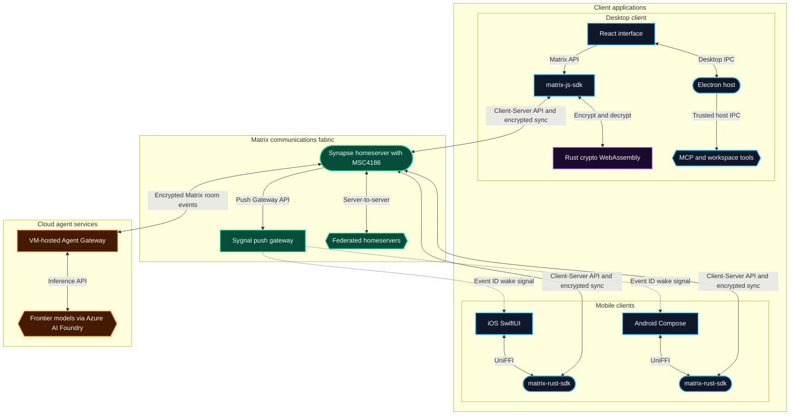

# 	Technology Stack for User Frontend

Seventwos bridges human intent and agentic execution across physical devices, native applications, and decentralized networks. In an applied AI ecosystem:

- **The workspace captures intent.**
- **The repository captures implementation.**
- **The communications fabric (Matrix) coordinates humans and agents in real time.**

To deliver secure, real-time collaboration with native device fidelity, Seventwos develops three upstream-derived clients: the desktop application is built from a fork of **Element Web / Element Desktop**, while the iOS and Android applications are built from forks of **Element X** for Matrix 2.0. The desktop uses Electron, React, `matrix-js-sdk`, and the Matrix Rust crypto stack compiled to WebAssembly; the native mobile applications use SwiftUI or Jetpack Compose over `matrix-rust-sdk`. Interaction patterns seen in applications such as **Claude Desktop** and the **GitHub Copilot app** remain design references only. Seventwos retains upstream attribution and publishes its modifications under AGPL-3.0.

This specification is intentionally stack-scoped: it defines runtime, protocol, storage, and licensing choices. Agent rosters, workflow choreography, and prompt policy are maintained in repository-level collaboration artifacts, not in this document.

---

## 1. Cross-Platform Platform Matrix

| Layer | Desktop Client | iOS Mobile Client | Android Mobile Client |
| :--- | :--- | :--- | :--- |
| **Upstream Foundation** | Fork of Element Web / Element Desktop | Fork of Element X iOS | Fork of Element X Android |
| **Host Shell / Runtime** | **Electron** (Chromium + Node.js) | Native Swift / iOS 18.5+ App | Native Kotlin / Modern Android App |
| **UI Framework** | **React + TypeScript** | **SwiftUI** (Declarative Native) | **Jetpack Compose** (Declarative Native) |
| **Design / Styling** | Element Web design system, evolving to Seventwos UI | Apple Human Interface Guidelines | Material Design 3 (M3) |
| **Core Communications Engine**| **`matrix-js-sdk`** + Rust crypto via WebAssembly | **`matrix-rust-sdk`** (via UniFFI / Swift Package) | **`matrix-rust-sdk`** (via UniFFI / Kotlin bindings) |
| **Sync Protocol** | Simplified Sliding Sync (MSC4186) | Simplified Sliding Sync (MSC4186) | Simplified Sliding Sync (MSC4186) |
| **Encryption (E2EE)** | Vodozemac client-side (Megolm / Olm) | Vodozemac client-side (Megolm / Olm) | Vodozemac client-side (Megolm / Olm) |
| **Extensibility & Tools** | Model Context Protocol (MCP Client) | In-app Action Sheets & Push Actions | In-app Action Sheets & Push Actions |
| **Workspace Model** | Git Worktrees (Multi-agent branches) | Mobile Activity & Task Views | Mobile Activity & Task Views |
| **Local Persistence** | Matrix JS SDK stores + Seshat encrypted search index | `matrix-rust-sdk` state store (SQLite) + Keychain | `matrix-rust-sdk` state store (SQLite) + SQLDelight + Keystore |
| **Push Notifications** | OS Native Notifications | Apple Push Notification service (APNs) | UnifiedPush / Firebase Cloud Messaging (FCM) |

---

## 2. System Architecture Topology

The platform integrates an Element Web-derived desktop client, Element X-derived mobile clients, a decentralized Matrix communications fabric, and cloud AI agent backends. The desktop application uses `matrix-js-sdk`; its Rust cryptographic implementation runs as WebAssembly inside the web application. The mobile clients call `matrix-rust-sdk` through UniFFI and render with native UI frameworks. End-to-end encryption remains client-side, and the homeserver relays only opaque ciphertext. All agent output reaches clients through the Matrix timeline; there is no out-of-band channel from the cloud backend into any client.

This topology is a work-in-progress reference based on the current architecture direction; some connection details (protocols and exact backend boundaries) are still being finalized and will be updated as they are confirmed.

---

## 3. Desktop Application Specification

The desktop client is optimized for high-intensity engineering, agent coordination, and local environment execution.

### 3.1. Shell Architecture: Element Web / Electron Fork
- **Upstream Foundation**: [`seventwos-app/usr-workspace-desktop`](https://github.com/seventwos-app/usr-workspace-desktop) is a fork of `element-hq/element-web`. Its `apps/desktop` package contains the Electron application previously maintained as Element Desktop.
- **Presentation Boundary**: Electron packages the React application with Chromium and provides Node.js-backed desktop integration through its main and preload processes.
- **Matrix Integration**: The application communicates through `matrix-js-sdk`. End-to-end encryption uses the Matrix Rust crypto stack compiled to WebAssembly, sharing the cryptographic implementation used by native clients without sharing their application SDK or UI code.
- **Transition State**: The repository still contains inherited Element code, branding, configuration, and a pinned upstream web bundle. Replacing that bundle with a Seventwos-authored interface is future work; the current client must not be described as independently authored.

### 3.2. Presentation Layer: React + TypeScript
- **Components & Layout**: The current desktop repository packages a pinned upstream web UI bundle built with Element Web's React and TypeScript architecture and design system.
- **Transition Direction**: A Seventwos-authored web bundle will replace the inherited bundle incrementally while preserving the Electron packaging and Matrix integration boundary.
- **Planned Workspace Canvases**: The Seventwos interface will add side-by-side surfaces for diff inspection, terminal execution, and Markdown preview.

### 3.3. Tool Protocol: Model Context Protocol (MCP)
- Adopts the open standard released by Anthropic in November 2024 and adopted across modern AI developer tooling:
  - Runs local MCP servers as subprocesses over `stdio` using newline-delimited JSON-RPC 2.0.
  - Connects to remote servers over **Streamable HTTP**, the transport introduced in MCP revision `2025-03-26` that superseded the deprecated HTTP+SSE transport. Legacy HTTP+SSE is supported only where older servers require it.
  - Exposes tools (file viewing, code search, git operations, browser execution, database queries) directly to active agents.
- **Placement constraint**: planned MCP process management belongs in Electron's trusted main process, not in renderer code. The renderer requests tool operations through a narrow preload API; the main process owns subprocess creation, permission checks, and lifecycle management.

### 3.4. Multi-Agent Workspace Isolation: Git Worktrees
- Aligns with the GitHub Copilot app's workspace-isolation pattern:
  - Each task turn runs in an isolated Git worktree.
  - Prevents dirty state collisions between concurrent agent sessions.
  - Guarantees that code commits remain atomic and auditable.

---

## 4. Mobile Client Specification (Element X Architecture)

The mobile applications are direct forks of **Element X iOS** and **Element X Android**, the native reference clients used to showcase Matrix 2.0. Both repositories currently contain inherited Element X application code and are being evolved toward separately authored Seventwos application layers. They retain the native declarative UI over a shared Rust core, preserve upstream attribution, and distribute inherited and modified application code under AGPL-3.0. See §6 for the licensing implications.

### 4.1. Core Engine: `matrix-rust-sdk`
- Both iOS and Android clients share a single, battle-tested cryptographic and protocol core written in Rust.
- **Key Capabilities**:
  - High-performance state storage and event caching.
  - End-to-end encryption via **Vodozemac** (pure-Rust implementation of Olm and Megolm protocols), executed entirely on-device — the homeserver never holds decryption keys.
  - Modern OIDC authentication flow (MSC2965 / MSC3861).
  - VoIP and group video integration via **MatrixRTC** (MSC4143).

### 4.2. iOS Application (Element X iOS)
- **Language & UI**: Swift 6 and **SwiftUI**, with a minimum deployment target of iOS 18.5.
- **Integration**: The Rust SDK is compiled as a multi-architecture framework and imported into the Xcode project via a Swift Package with **UniFFI** bindings.
- **iOS-Specific Features**:
  - Background sync using iOS Background Tasks framework.
  - Secure key storage in the Apple Keychain with Face ID / Touch ID biometric authentication.
  - **Interactive push notifications** via APNs. Because room content is encrypted, the APNs payload carries only an event identifier and routing metadata — never plaintext. A **Notification Service Extension (NSE)** wakes in a separate process, opens its own `matrix-rust-sdk` client against the crypto store shared through an App Group container and Keychain Access Group, fetches the referenced event, and decrypts it on-device before the notification is displayed.

### 4.3. Android Application (Element X Android)
- **Language & UI**: Kotlin and **Jetpack Compose**.
- **Integration**: `matrix-rust-sdk` is compiled into native libraries (`.so`) for ARM/x86 architectures, exposed through Kotlin wrappers generated via **UniFFI**.
- **Android-Specific Features**:
  - Android Keystore integration for cryptographic key protection.
  - Local persistence via the SDK state store, with **SQLDelight** for typed application-side queries.
  - Flexible push architecture supporting both UnifiedPush (privacy-focused) and Firebase Cloud Messaging (FCM). As on iOS, the push payload is a wake signal carrying an event identifier; the app resolves and decrypts the event locally through the SDK before building the notification.
  - Native Material Design 3 theming with dynamic color adaptability.

---

## 5. Communications Fabric: Matrix Protocol (matrix.org)

Matrix provides the decentralized, secure messaging backbone connecting humans and AI agents.

### 5.1. Why Matrix for Agentic Workflows?
1. **Decentralized & Federatable**: Organizations own their data; private homeservers ensure sensitive workspace conversations never leak to third-party proprietary chat servers.
2. **First-Class Agent Identity**: Each AI agent is intended to participate through a Matrix account within shared rooms — addressable, attributable, and subject to the same room membership and permission model as human participants, against the deployed Matrix backend, confirmed via direct inspection of Seventwos' Azure infrastructure. The exact authentication and device model this backend exposes remain to be documented in this specification.
3. **Client-Side End-to-End Encryption**: Task deliberations, code diff reviews, and intent discussions are encrypted on-device via Vodozemac. Homeservers relay opaque ciphertext and never hold Megolm session keys.
4. **Simplified Sliding Sync (MSC4186)**: Reduces room synchronization times from tens of seconds to milliseconds. Served natively by the homeserver — the standalone MSC3575 proxy was sunset in November 2024 and is not part of this architecture.

### 5.2. Backend Integration & Agent Connectivity
- **Agent Gateway**:
  - A Matrix backend is deployed, and the Agent Gateway connects to it directly; the exact client authentication, event-consumption, and encryption mechanism this connection uses remain to be documented in this specification. The gateway is VM-hosted rather than a serverless function app. Its operational surface (deployment, dashboard access, and administration) is tracked in an internal repository; its internal implementation details are not disclosed in this specification.
  - Inbound Matrix events are intended to trigger agent workflows in the cloud backend.
  - The agent orchestrator coordinates frontier models reachable through Azure AI Foundry.
  - Agents format replies using structured Markdown, interactive widget definitions, and diff payloads posted directly back into the Matrix room timeline.
  - **No out-of-band client channel**: the gateway never pushes to a client directly. Every dispatch, diff, and status update is a room event. This keeps agent output inside the room permission model and audit trail, ensures desktop and mobile observers converge on the same state, and avoids requiring inbound network reachability to clients behind NAT.
- **Push Gateway (Sygnal)**:
  - Homeservers do not contact APNs or FCM directly; they call a push gateway over the Matrix Push Gateway API, which holds the platform credentials and forwards the wake signal.

---

## 6. Licensing & Reuse Posture

The foundations this specification builds on do not share a single licence. Low-level SDK and runtime dependencies are generally permissive, while all three current application repositories derive from AGPL-licensed Element clients.

| Component | Licence | Reuse Implication |
| :--- | :--- | :--- |
| `matrix-rust-sdk` (incl. `matrix-sdk-crypto`, `matrix-sdk-sqlite`) | Apache-2.0 | Embeddable as a dependency in a proprietary client without source-disclosure obligations. |
| `matrix-js-sdk` | Apache-2.0 | Embeddable as a dependency; used by the desktop fork. |
| Vodozemac | Apache-2.0 | Embeddable; consumed transitively through `matrix-sdk-crypto`. |
| Electron | MIT | Embeddable as the desktop host shell. |
| Element Web / Desktop | AGPL-3.0 | Current desktop upstream. Seventwos publishes inherited code and its modifications under AGPL-3.0. |
| Element X iOS / Android | AGPL-3.0 **or** Element Commercial Licence upstream; Seventwos forks use AGPL-3.0-only | Current mobile upstreams. The Seventwos repositories preserve attribution and publish modifications under AGPL-3.0. |
| Synapse | AGPL-3.0, or commercial licence from Element | Operating a modified homeserver as a network service requires publishing source, or a commercial agreement. |

**Consequence for this architecture.** The desktop, iOS, and Android repositories are application-level forks, not clean-room implementations that merely reference Element. Each repository identifies its upstream, retains the applicable copyright notices, and applies AGPL-3.0-only to Seventwos modifications and newly authored repository code. Corresponding source must remain available when modified applications are distributed or made available for network interaction under the AGPL. A future replacement of inherited application layers can narrow this obligation only after provenance confirms that no AGPL-derived application code remains. Synapse is deployed unmodified; modifying it would create a separate source-availability obligation.

Claude Desktop and the GitHub Copilot app are not implementation foundations. They remain proprietary design references, with no source-code reuse or implied affiliation.

---

## 7. Fact-Checking & Source Verification

*Each specification item below carries a verification status. `[VERIFIED]` items are confirmed against a primary source — a protocol specification, official announcement, or the vendor's own public repository. `[DIRECTIONAL]` items are widely reported and consistent with observable evidence, but no vendor publishes an authoritative architecture manifest for them; they are recorded here as working assumptions rather than established fact.*

| # | Specification Item | Verification Detail | Status | Authoritative Source | Confidence |
|---|-------------------|---------------------|--------|----------------------|------------|
| 1 | Claude Desktop Host | Widely reported as an Electron application using web technologies for macOS and Windows. Anthropic publishes MCP configuration guidance for the client but no client architecture manifest, so this rests on distribution-bundle inspection rather than a vendor statement. | `[DIRECTIONAL]` | [Anthropic MCP Documentation](https://modelcontextprotocol.io/docs/develop/connect-local-servers) (configuration only) | 3/5 |
| 2 | GitHub Copilot App | Git worktree session isolation is an observable, documented Copilot coding-agent pattern. The application is a design reference only; its implementation is not an upstream source for Seventwos. | `[DIRECTIONAL]` | [GitHub Copilot Documentation](https://docs.github.com/en/copilot) | 3/5 |
| 3 | Element X Core SDK | Element X iOS and Element X Android share `matrix-rust-sdk` as their foundational synchronization and crypto engine. | `[VERIFIED]` | [Element X Official Announcement & GitHub Repositories](https://github.com/element-hq/element-x-ios) | 5/5 |
| 4 | Element X iOS Tech Stack | Written in Swift and SwiftUI, interfacing with `matrix-rust-sdk` via Swift Package and UniFFI FFI bindings. | `[VERIFIED]` | [Element X iOS Repository](https://github.com/element-hq/element-x-ios) | 5/5 |
| 5 | Element X Android Tech Stack | Written in Kotlin and Jetpack Compose, communicating with `matrix-rust-sdk` through UniFFI bindings. | `[VERIFIED]` | [Element X Android Repository](https://github.com/element-hq/element-x-android) | 5/5 |
| 6 | Matrix 2.0 Sync Protocol | Simplified Sliding Sync (MSC4186) is served natively by Synapse. It supersedes MSC3575; the standalone sliding-sync proxy was shut down on 21 November 2024 and client support was dropped in January 2025. | `[VERIFIED]` | [Matrix.org: Sunsetting the Sliding Sync Proxy](https://matrix.org/blog/2024/11/14/moving-to-native-sliding-sync/) | 5/5 |
| 7 | E2EE Trust Boundary | Vodozemac (Olm / Megolm in Rust) executes inside each client's `matrix-sdk-crypto`. Homeservers and sync endpoints relay opaque `m.room.encrypted` payloads and never hold Megolm session keys. | `[VERIFIED]` | [matrix-org/vodozemac](https://github.com/matrix-org/vodozemac) & [Matrix E2EE Concepts](https://matrix.org/docs/matrix-concepts/end-to-end-encryption/) | 5/5 |
| 8 | Agent Gateway Matrix Boundary | No separate Matrix Application Service is part of the Seventwos architecture. A Matrix backend is deployed, and the Agent Gateway — a VM-hosted service — connects to it directly and reaches frontier models through Azure AI Foundry; its exact protocol, authentication, and E2EE implementation are not yet documented in this specification. | `[DIRECTIONAL]` | Seventwos internal infrastructure inventory (not publicly published) | 4/5 |
| 9 | MCP Local Transport | MCP clients spawn local servers as subprocesses and exchange newline-delimited JSON-RPC 2.0 messages over stdio. | `[VERIFIED]` | [Model Context Protocol: Transports](https://modelcontextprotocol.io/specification/2025-03-26/basic/transports) | 5/5 |
| 10 | MCP Remote Transport | Streamable HTTP was introduced in MCP revision `2025-03-26` and supersedes the HTTP+SSE transport defined in `2024-11-05`, which is deprecated and retained only for backward compatibility. | `[VERIFIED]` | [MCP Specification: Streamable HTTP](https://modelcontextprotocol.io/specification/2025-03-26/basic/transports) | 5/5 |
| 11 | Element X Local Persistence | Neither client uses CoreData or Room. Both delegate room state to the `matrix-rust-sdk` SQLite state store; Element X Android additionally uses SQLDelight (`app.cash.sqldelight` 2.3.2), and Element X iOS uses `KeychainAccess` for credential storage. | `[VERIFIED]` | [element-x-android `libs.versions.toml`](https://github.com/element-hq/element-x-android/blob/develop/gradle/libs.versions.toml) & [element-x-ios `project.yml`](https://github.com/element-hq/element-x-ios/blob/develop/project.yml) | 5/5 |
| 12 | Element X iOS Deployment Target | `project.yml` declares a minimum deployment target of iOS 18.5 and consumes `matrix-rust-components-swift` as a pinned Swift Package. | `[VERIFIED]` | [element-x-ios `project.yml`](https://github.com/element-hq/element-x-ios/blob/develop/project.yml) | 5/5 |
| 13 | Desktop SDK Boundary | The desktop fork uses `matrix-js-sdk`, with Matrix's Rust crypto implementation compiled to WebAssembly. It shares cryptographic implementation with mobile, not a single cross-platform application SDK. | `[VERIFIED]` | [Seventwos Workspace for Desktop](https://github.com/seventwos-app/usr-workspace-desktop) | 5/5 |
| 14 | Permissive Core Licensing | `matrix-rust-sdk` and `matrix-js-sdk` are Apache-2.0 dependencies, while Electron is MIT-licensed. Their permissive licences do not override the AGPL obligations inherited by the application forks. | `[VERIFIED]` | [Matrix Rust SDK](https://github.com/matrix-org/matrix-rust-sdk), [Matrix JS SDK](https://github.com/matrix-org/matrix-js-sdk), and [Electron](https://github.com/electron/electron) | 5/5 |
| 15 | Copyleft Application Tier | The three Seventwos client repositories are forks of Element Web, Element X iOS, and Element X Android, and identify their repository-owned modifications as AGPL-3.0-only. | `[VERIFIED]` | [Desktop](https://github.com/seventwos-app/usr-workspace-desktop), [iOS](https://github.com/seventwos-app/usr-workspace-ios), and [Android](https://github.com/seventwos-app/usr-workspace-android) repositories | 5/5 |
| 16 | MatrixRTC Specification Anchor | The SDK workspace enables the `unstable-msc4143` ruma feature, confirming MSC4143 as the MatrixRTC anchor. | `[VERIFIED]` | [matrix-rust-sdk `Cargo.toml`](https://github.com/matrix-org/matrix-rust-sdk/blob/main/Cargo.toml) | 5/5 |
| 17 | Element X Dual Licensing | Element X is dual-licensed: its README offers use under AGPL-3.0 **or** a paid Element Commercial Licence, and source files carry `SPDX-License-Identifier: AGPL-3.0-only OR LicenseRef-Element-Commercial`. Characterising it as AGPL-only understates the available terms. | `[VERIFIED]` | [element-x-ios `README.md`](https://github.com/element-hq/element-x-ios/blob/develop/README.md) | 5/5 |
| 18 | Encrypted Push Requires On-Device Decryption | E2EE push payloads carry only event and routing identifiers. Element X iOS ships a dedicated `NSE` target whose `NSEUserSession` constructs a `matrix-rust-sdk` client (`makeNSEClient`) to fetch and decrypt the referenced event before display. | `[VERIFIED]` | [element-x-ios `NSE/Sources/NSEUserSession.swift`](https://github.com/element-hq/element-x-ios/blob/develop/NSE/Sources/NSEUserSession.swift) | 5/5 |
| 19 | Push Gateway Indirection | Homeservers do not contact APNs or FCM directly; they notify a push gateway via `POST /_matrix/push/v1/notify`, which holds platform credentials and forwards the wake signal. | `[VERIFIED]` | [Matrix Push Gateway API](https://spec.matrix.org/latest/push-gateway-api/) | 5/5 |
| 20 | Sync Protocol Is Downstream-Only | MSC4186 streams timeline and state to clients. Sending events, uploading and querying one-time keys, to-device key distribution, and OIDC authentication all use separate Client-Server API endpoints, so a client wired only to the sync endpoint could receive but never send. | `[VERIFIED]` | [Matrix Client-Server API](https://spec.matrix.org/latest/client-server-api/) | 5/5 |
| 21 | Fork Provenance | GitHub records the desktop repository as a fork of `element-hq/element-web`, and the iOS and Android repositories as forks of their corresponding Element X clients. Their READMEs describe the inherited code and transition state explicitly. | `[VERIFIED]` | [Desktop](https://github.com/seventwos-app/usr-workspace-desktop), [iOS](https://github.com/seventwos-app/usr-workspace-ios), and [Android](https://github.com/seventwos-app/usr-workspace-android) repositories | 5/5 |
